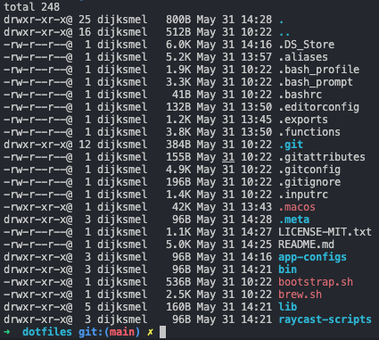

# Melle’s dotfiles



## Installation

**Warning:** If you want to give these dotfiles a try, you should first fork this repository, review the code, and remove things you don’t want or need. Don’t blindly use my settings unless you know what that entails. Use at your own risk!

## Requirements

- Brew (https://brew.sh/)

## Installation

### [WIP] Automatic Install Without Git Clone

To install these dotfiles without Git:

```bash
# TODO: Update this script execution to be correct when repository is actually installable from a single command
# cd; curl -#L https://github.com/melledijkstra/dotfiles/tarball/main | tar -xzv --strip-components 1 --exclude={README.md,bootstrap.sh,.osx,LICENSE-MIT.txt}
```

### Using Git and the bootstrap script

You can clone the repository wherever you want. (I like to keep it in `~/projects/dotfiles`). The bootstrapper script will pull in the latest version and assist with installing the files in the correct place.

```bash
git clone https://github.com/melledijkstra/dotfiles.git
cd dotfiles
brew bundle install
source bootstrap.sh
```

## Updating the dotfiles

// TODO: actually make all scripts to be executable multiple times without messing things up

To update at any time, just run the same installation script and it will update anything needed to be updated.

### Update only the dotfiles

To only update the home directory (~/) dot files (.zshrc, .path, .exports, etc.)
run the following command:

```bash
./bootstrap.sh
```

## Configurations

### Specify the `$PATH`

Here’s an example `~/.path` file that adds `/usr/local/bin` to the `$PATH`:

```bash
export PATH="/usr/local/bin:$PATH"
```

### Add secret configurations

In order to keep sensitive data safe, you can put any of that information in the .secrets file.
e.g. personal access tokens, emails, passwords, api keys, etc.

An example of my `.secrets` file can be found in `home/.secrets.example`

You could also use `~/.secrets` to override settings, functions and aliases from my dotfiles repository. It’s probably better to [fork this repository](https://github.com/melledijkstra/dotfiles/fork) instead, though.

### Sensible macOS defaults

When setting up a new Mac, you may want to set some sensible macOS defaults:

```bash
./macos.sh
```

### Install Homebrew formulae

When setting up a new Mac, you may want to install some common [Homebrew](https://brew.sh/) formulae (after installing Homebrew, of course):

```bash
./brew.sh
```

Some of the functionality of these dotfiles depends on formulae installed by `brew.sh`. If you don’t plan to run `brew.sh`, you should look carefully through the script and manually install any particularly important ones.
